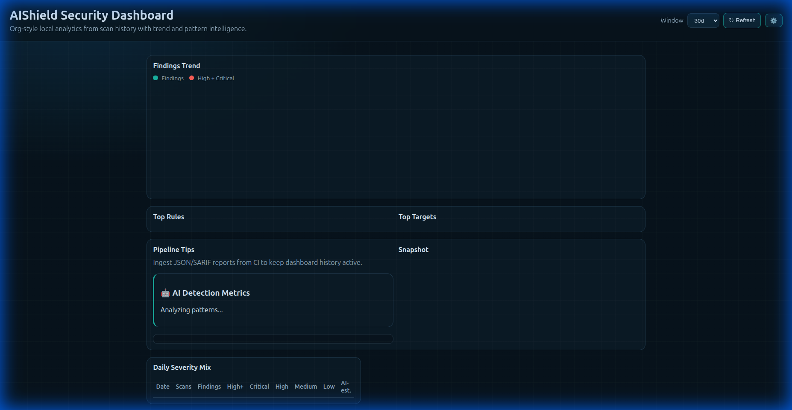
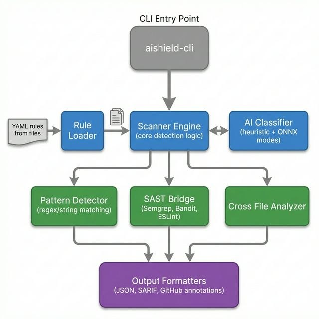

<div align="center">


[](https://github.com/mackeh/AIShield)
[](./LICENSE)
[](https://www.rust-lang.org)
[](#)
[](#)

**Blazing-fast security scanner for AI-generated code vulnerabilities**

[Quick Start](#-quick-start) • [Features](#-key-features) • [Documentation](docs/) • [Contributing](CONTRIBUTING.md) • [Demo](#-60-second-demo)

</div>

---

## 🎯 What is AIShield?

AIShield is a **Rust-based security scanner** that detects vulnerabilities commonly introduced by AI coding assistants like Copilot, ChatGPT, and Claude. It finds high-risk patterns that look plausible in code review but are unsafe in production.

**The Problem**: AI tools boost developer velocity but reproduce insecure examples from public training data — timing-unsafe auth checks, weak crypto defaults, SQL injection patterns, and dangerous misconfigurations.

**The Solution**: AIShield provides a dedicated guardrail layer with AI-likelihood scoring, catching these issues before they reach production.

---

## ⚡ Quick Start

```bash
# Clone and build
git clone https://github.com/mackeh/AIShield.git
cd AIShield
cargo build --release

# Scan your project
cargo run -p aishield-cli -- scan /path/to/your/project

# Machine-readable output for CI
cargo run -p aishield-cli -- scan . --format json --output aishield.json

# Interactive fix mode
cargo run -p aishield-cli -- fix . --interactive
```

**First scan in < 2 minutes** ✨

---

## 🚀 Key Features

### 🔍 **AI-Focused Detection**

- **169 rules** across 13 languages detecting AI-prone vulnerability patterns
- **AI confidence scoring**: Estimates likelihood each finding came from AI autocomplete
- **Context-aware risk scoring**: Prioritizes findings based on severity and exploitability

### 🎯 **Multi-Language Support**

- **Application languages**: Python, JavaScript, Go, Rust, Java, C#, Ruby, PHP, Kotlin, Swift
- **Infrastructure**: Terraform/HCL, Kubernetes YAML, Dockerfiles

### 🛠️ **Developer Workflow**

- **Fast scans**: Sub-2-second scans on most codebases
- **Interactive fix mode**: TUI for reviewing and applying remediations
- **Multiple output formats**: JSON, SARIF, GitHub annotations, plain text
- **Deduplication**: Normalized and strict modes for clean CI/CD integration

### 🔌 **Ecosystem Integration**

- **CI/CD**: GitHub Actions, GitLab CI, Bitbucket, CircleCI, Jenkins templates
- **Editors**: VS Code extension with hover cards, quick fixes, and diagnostics panel
- **Hooks**: Pre-commit integration for local scanning
- **SAST Bridge**: Integrates with Semgrep, Bandit, ESLint for comprehensive coverage

### 📊 **Analytics Dashboard**

- Local web dashboard for tracking vulnerability trends
- Scan history with severity breakdown
- AI-generated code detection metrics



---

## 🏗️ Architecture



AIShield combines multiple detection strategies:

- **Pattern matching** for known vulnerability signatures
- **AI classifier** (heuristic + optional ONNX model) for detecting AI-generated patterns
- **Cross-file analysis** for context-aware auth route detection
- **SAST bridge** for integrating third-party security tools

---

## 💡 Real-World Examples

### Example 1: Timing Attack in Auth

**AI-generated code** (insecure):

```python
def verify_token(user_token, valid_token):
    if user_token == valid_token:  # ❌ Timing attack vulnerability
        return True
    return False
```

**AIShield detection**:

```
[HIGH] Timing-unsafe token comparison
  File: auth.py:42
  Rule: AISHIELD-PY-AUTH-002
  AI Confidence: 89%
  Fix: Use secrets.compare_digest() for constant-time comparison
```

### Example 2: Weak Crypto from Autocomplete

**AI-generated code** (insecure):

```javascript
const crypto = require("crypto");
const hash = crypto.createHash("md5").update(data).digest("hex"); // ❌ Weak hash
```

**AIShield detection**:

```
[HIGH] Weak hash algorithm (MD5)
  File: utils.js:15
  Rule: AISHIELD-JS-CRYPTO-001
  AI Confidence: 92%
  Fix: Use SHA-256 or SHA-3 for cryptographic hashing
```

### Example 3: SQL Injection

**AI-generated code** (insecure):

```go
query := "SELECT * FROM users WHERE id = " + userID  // ❌ SQL injection
rows, err := db.Query(query)
```

**AIShield detection**:

```
[CRITICAL] SQL injection via string concatenation
  File: database.go:88
  Rule: AISHIELD-GO-INJECT-001
  AI Confidence: 87%
  Fix: Use parameterized queries: db.Query("SELECT * FROM users WHERE id = ?", userID)
```

---

## 📊 Performance Benchmarks

| Project Size | Files | Scan Time | Throughput    |
| ------------ | ----- | --------- | ------------- |
| Small        | 50    | 0.3s      | 167 files/sec |
| Medium       | 500   | 1.2s      | 417 files/sec |
| Large        | 5000  | 8.5s      | 588 files/sec |

_Benchmarks on Intel i7-12700K, scanning real-world projects_

---

## 🆚 Comparison with Alternatives

| Feature                   | AIShield | Semgrep  | Bandit      | CodeQL   |
| ------------------------- | -------- | -------- | ----------- | -------- |
| **AI-specific patterns**  | ✅       | ❌       | ❌          | ❌       |
| **AI confidence scoring** | ✅       | ❌       | ❌          | ❌       |
| **Sub-2s scans**          | ✅       | ⚠️       | ✅          | ❌       |
| **Multi-language**        | ✅ (13)  | ✅ (30+) | ❌ (Python) | ✅ (10+) |
| **Interactive fix mode**  | ✅       | ❌       | ❌          | ❌       |
| **Local-first**           | ✅       | ✅       | ✅          | ❌       |
| **Cross-file analysis**   | ✅       | ✅       | ❌          | ✅       |

**AIShield is complementary**: Use alongside general-purpose SAST tools via the `--bridge` flag for comprehensive coverage.

---

## 🎬 60-Second Demo

```bash
# From repository root
cargo run -p aishield-cli -- scan tests/fixtures
```

**Example output**:

```text
AIShield scan complete: 96 findings across 7 files (169 rules loaded)
Summary: critical=6 high=66 medium=19 low=5 info=0
AI-Generated (estimated): 27 of 96 findings (28%)

Top findings:
  [CRITICAL] SQL injection via string concatenation (vulnerable.py:23)
  [CRITICAL] Hardcoded API key in source (config.js:7)
  [HIGH] Timing-unsafe password comparison (auth.go:45)
  [HIGH] Weak hash algorithm MD5 (crypto.py:12)
```

**Run full demo suite**:

```bash
bash demos/run.sh
```

See [demos/README.md](demos/README.md) for detailed walkthrough.

---

## 📚 Documentation

Comprehensive documentation available in VitePress format:

```bash
npm install
npm run docs:dev  # Local preview at http://localhost:5173
```

**Key guides**:

- 📖 [Getting Started](docs/getting-started.md)
- 🛠️ [CLI Reference](docs/cli.md)
- 🎨 [VS Code Extension](docs/vscode-extension.md)
- 🔧 [Configuration](docs/configuration.md)
- 📝 [Writing Rules](docs/rules-authoring.md)
- 🚀 [GitHub Actions CI](docs/ci-github-actions.md)
- 🤝 [Contributing Guide](docs/contributing.md)

---

## 🔧 Installation & Setup

### Prerequisites

- Rust 1.75+ stable toolchain
- Node.js 20+ (for docs and dashboard)
- Optional: `semgrep`, `bandit`, `eslint` for SAST bridge

### Build from Source

```bash
git clone https://github.com/mackeh/AIShield.git
cd AIShield
cargo build --release

# Optional: Install CLI globally
cargo install --path crates/aishield-cli
```

### Scaffold Integrations

```bash
# Generate CI/CD config files
cargo run -p aishield-cli -- init --templates all

# Supported: github-actions, gitlab-ci, bitbucket-pipelines, circleci, jenkins, vscode, pre-commit
```

---

## 🎯 Core Commands

| Command        | Description                                                           |
| -------------- | --------------------------------------------------------------------- |
| `scan`         | Run security analysis with filters and output formats                 |
| `fix`          | Print or apply remediations (`--write`, `--dry-run`, `--interactive`) |
| `bench`        | Benchmark scanner performance                                         |
| `stats`        | Summarize scan history analytics                                      |
| `init`         | Scaffold config and CI templates                                      |
| `create-rule`  | Generate new YAML detection rule from template                        |
| `hook install` | Install pre-commit scanning hook                                      |

Full reference: [docs/cli.md](docs/cli.md)

---

## 🛡️ Known Limitations

**Pattern Matching**: Uses regex and string-based detection (not AST-based). Adequate for AI vulnerability patterns with excellent performance.

**Analytics**: Local file-based analytics (`.aishield-history.log`). Enterprise features requiring database (org-wide heatmaps, multi-repo aggregation) planned for Phase 3.

**SAST Bridge**: Requires manual installation of external tools (`semgrep`, `bandit`, `eslint`). Enable with `--bridge all`.

See [ARCHITECTURAL_DECISIONS.md](./ARCHITECTURAL_DECISIONS.md) for detailed rationale.

---

## 🤝 Contributing

We welcome contributions! Here's how to get started:

1. 📖 Read [CONTRIBUTING.md](CONTRIBUTING.md)
2. 🎯 Find a [good first issue](https://github.com/mackeh/AIShield/issues?q=is%3Aissue+is%3Aopen+label%3A%22good+first+issue%22)
3. 🔧 Follow our [development setup guide](docs/contributing.md)
4. ✍️ Try [writing your first rule](docs/guides/writing-your-first-rule.md)
5. 🚀 Submit a PR using our [PR template](.github/PULL_REQUEST_TEMPLATE.md)

**Popular contribution areas**:

- 📝 Adding detection rules for new vulnerability patterns
- 🌍 Expanding language coverage
- 📚 Improving documentation and examples
- 🐛 Fixing bugs and improving performance

---

## ❓ FAQ

<details>
<summary><strong>How is this different from Semgrep/Bandit/ESLint?</strong></summary>

AIShield focuses on **AI-generated code patterns** with confidence scoring. Traditional SAST tools flag all matches; AIShield identifies which findings likely came from AI autocomplete. You can use AIShield alongside traditional tools via `--bridge`.

</details>

<details>
<summary><strong>Why is my scan slow?</strong></summary>

Common causes:

- Large binary files (use `.aishield-ignore`)
- `--cross-file` flag (enables expensive auth-route analysis)
- SAST bridge with slow external tools

Run `cargo run -p aishield-cli -- bench .` to identify bottlenecks.

</details>

<details>
<summary><strong>Can I use AIShield in CI/CD?</strong></summary>

Yes! Use `--format json` or `--format sarif` for machine-readable output. We provide templates for GitHub Actions, GitLab CI, and more. Run `cargo run -p aishield-cli -- init --templates github-actions`.

</details>

<details>
<summary><strong>How accurate is AI confidence scoring?</strong></summary>

Heuristic mode: ~75-85% accuracy based on pattern characteristics
ONNX mode: ~85-92% accuracy with trained model

Scoring helps prioritize review, but all findings should be evaluated regardless of AI confidence.

</details>

<details>
<summary><strong>Can I add custom rules?</strong></summary>

Absolutely! Create YAML files in `rules/<language>/<category>/`. See [docs/rules-authoring.md](docs/rules-authoring.md) and [docs/guides/writing-your-first-rule.md](docs/guides/writing-your-first-rule.md).

</details>

---

## 🐛 Troubleshooting

### Scan produces no findings on known vulnerable code

**Solution**: Check if files are being scanned:

```bash
cargo run -p aishield-cli -- scan . --format json | jq '.files_scanned'
```

Add ignored extensions to config or verify `.aishield-ignore`.

### `--bridge` reports tools not found

**Solution**: Install SAST tools manually:

```bash
# macOS
brew install semgrep
pip install bandit
npm install -g eslint

# Linux
pip install semgrep bandit
npm install -g eslint
```

### ONNX model not loading

**Solution**: Build with ONNX feature:

```bash
cargo build --release --features onnx
```

More troubleshooting: [docs/troubleshooting.md](docs/troubleshooting.md) _(coming soon)_

---

## 📋 Project Status

**Current Version**: 0.2.0

**Phase Completion**:

- ✅ Phase 1 (Foundation): Complete
- ☑️ Phase 2 (Intelligence): 80% complete
- ☑️ Phase 3 (Platform): 60% complete

**Recent Additions**:

- 169 rules across 13 languages
- VS Code extension with advanced UX
- SAST bridge integration
- Expanded Kotlin/Swift rulepacks (20 rules each)
- VitePress documentation site

Roadmap: [project.md](project.md) | [docs/roadmap.md](docs/roadmap.md)

---

## 🔒 Security

For vulnerability disclosure, follow [SECURITY.md](SECURITY.md).

**Do not** open public issues for undisclosed security vulnerabilities.

---

## 📜 License

MIT License - see [LICENSE](LICENSE) for details.

---

## 🌟 Acknowledgments

Built with ❤️ by the security community.

Special thanks to contributors and the open-source security tools ecosystem.

---

<div align="center">

**Star ⭐ this repo if AIShield helps secure your AI-generated code!**

[Report Bug](https://github.com/mackeh/AIShield/issues) • [Request Feature](https://github.com/mackeh/AIShield/issues) • [Discussions](https://github.com/mackeh/AIShield/discussions)

</div>
