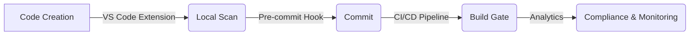

# DevSecOps Workflow with AIShield

This guide outlines how to integrate AIShield into a complete DevSecOps lifecycle, ensuring AI-generated vulnerabilities are caught early and often.

## The "Shift Left" Strategy

AIShield is designed to run at every stage of the development lifecycle.



### 1. IDE Integration (The First Line of Defense)
Developers should see vulnerabilities as they type.
*   **Action:** Install the AIShield VS Code extension.
*   **Benefit:** Real-time feedback prevents vulnerable code from ever being saved.

### 2. Pre-Commit Hooks (The Safety Net)
Prevent vulnerable code from entering the git history.
*   **Action:** Install the hook in your repo:
    ```bash
    cargo run -p aishield-cli -- hook install
    ```
*   **Configuration:** The hook runs `scan --staged`.

### 3. CI/CD Integration (The Gatekeeper)
Enforce security standards before merging. AIShield supports scanning your **pipeline configuration** itself (GitHub Actions) as well as your application code.

**Example: GitHub Actions Workflow**

```yaml
name: AIShield Security Scan
on: [pull_request]
jobs:
  security:
    runs-on: ubuntu-latest
    steps:
      - uses: actions/checkout@v3
      - name: Install AIShield
        run: |
          curl -L https://github.com/mackeh/AIShield/releases/latest/download/aishield-linux -o aishield
          chmod +x aishield
      
      # Step 1: Scan the Application Code
      - name: Scan Codebase
        run: ./aishield scan . --format sarif --output aishield.sarif
      
      # Step 2: Scan the CI Pipeline Configuration (Self-Protection)
      - name: Scan Workflows
        run: ./aishield scan .github/workflows --format text
        
      - name: Upload SARIF
        uses: github/codeql-action/upload-sarif@v2
        with:
          sarif_file: aishield.sarif
```

> **New Feature:** AIShield now detects insecure GitHub Actions configurations (e.g., `pull_request_target` abuse).

### 4. Policy Enforcement (The Gavel)
You can fail builds based on severity thresholds or AI confidence levels.

**Fail on Critical Vulnerabilities:**
```bash
./aishield scan . --fail-on critical
```

**Fail on High Confidence AI-Generated Issues:**
```bash
./aishield scan . --min-ai-confidence 0.90 --fail-on high
```

### 5. Continuous Monitoring (The Watchtower)
Use the Analytics API to track your security posture over time.
*   **Trend Analysis:** Are AI-generated vulnerabilities increasing?
*   **Hotspots:** Which repositories or teams introduce the most risk?

## Best Practices

1.  **Treat Infrastructure as Code:** AIShield scans Terraform, Kubernetes, and Dockerfiles. Include these in your regular scans.
2.  **Monitor the Pipeline:** Your CI/CD configuration is code. Scan it!
3.  **Bridge with SAST:** Use the `--bridge` flag to run Semgrep/Bandit alongside AIShield for total coverage.
4.  **Feedback Loop:** Use the findings to update your `rules/` with custom patterns specific to your organization's AI usage.
